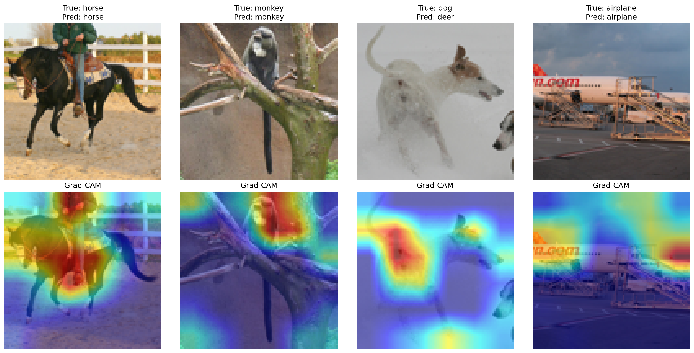

# Self-Supervised Learning in the Low-Data Regime

**[Try the live demo →](https://low-data-ssl.onrender.com)**

Comparing self-supervised pretraining (SimSiam) against supervised
baselines, data augmentation, and ImageNet transfer learning — across
three CNN backbones and six labeled-data percentages (1% to 100%) — to
find out when SSL pretraining is actually worth the extra compute.

The live demo has four sections: **Home** (motivation, quick navigation,
and a filterable ranked comparison of all 12 combinations), **Classify**
(pick a backbone + strategy, upload an image), **Compare All** (upload one
image, see all 12 combinations classify it at once, grouped by backbone),
and **History** (this session's past predictions).

Full methodology, dataset details, seed policy, and limitations are in
[`PROJECT_DOCUMENTATION.md`](./PROJECT_DOCUMENTATION.md).

## Key finding

The crossover point where SimSiam beats ImageNet transfer learning is
**backbone-specific, not universal**: it only holds for ResNet18, and even
there only in the extreme low-data regime (≤10% labels). For MobileNetV2
and EfficientNet-B0, ImageNet transfer wins at *every* label percentage
tested, including 1%. The best-performing combination overall isn't the
SSL pipeline this project was built around — it's **EfficientNet-B0 fine-tuned
from free ImageNet weights**, which beats every other combination
(including the previously-reported best, MobileNetV2) at every label
percentage.

| Label % | ResNet18 Baseline | ResNet18 SimSiam | EfficientNet-B0 ImageNet |
|---|---|---|---|
| 1% | 20.8% | **56.7%** | **59.1%** |
| 10% | 37.1% | 70.1% | **78.8%** |
| 100% | 61.5% | 76.1% | **89.3%** |

Full 3-backbone × 4-strategy comparison table (12 combinations) in
[`PROJECT_DOCUMENTATION.md`, Section 11](./PROJECT_DOCUMENTATION.md#11-results-all-three-backbones).

## Efficiency

| Model | Params | Size (MB) | Inference Time | FPS |
|---|---|---|---|---|
| ResNet18 | 11.18M | 42.73 MB | **3.89 ms** | **257.3** |
| MobileNetV2 | 2.24M | **8.76 MB** | 7.18 ms | 139.4 |
| EfficientNet-B0 | 4.02M | 15.62 MB | 10.61 ms | 94.3 |

Fewer parameters doesn't mean faster GPU inference — ResNet18 is both the
largest model here and the fastest at inference, while EfficientNet-B0 is
mid-sized but the slowest of the three. Both MobileNetV2 and
EfficientNet-B0 rely on depthwise separable convolutions that parallelize
less efficiently on GPU hardware than ResNet18's standard convolutions at
batch size 1. Despite this, EfficientNet-B0 + ImageNet Transfer is the
deployed default in the live demo (Section
[11.6](./PROJECT_DOCUMENTATION.md#116-deployment-decision)) — sub-15ms
inference is imperceptible for an interactive single-image demo regardless
of which of the three is used, so accuracy was weighted over speed. The
live app lets you pick any of the other 11 combinations yourself if speed
or size matters more for your use case.

**Note on out-of-distribution inputs:** the deployed app always predicts
one of the 10 trained classes, with no "none of the above" option — OOD
detection was explicitly cut from scope (see
[Section 10](./PROJECT_DOCUMENTATION.md#10-scope-decisions-what-was-deliberately-cut-and-why)).
In informal testing, images of people were confidently classified as
"dog" or "monkey" — expected behavior for a classifier with no OOD
awareness, not a bug.

## Explainability (Grad-CAM)



Grad-CAM on MobileNetV2 + ImageNet transfer, 100% labels — generated when
MobileNetV2 was still the deployment default. **Note:** the deployment
default later changed to EfficientNet-B0 (Section 11.2), and this figure
was not regenerated for that backbone — `evaluation/gradcam.py` has an
EfficientNet-B0 target-layer choice, but it's explicitly flagged in that
file as unverified against real output, unlike the MobileNetV2 layer used
here. STL-10's 96×96 images collapse to a very coarse spatial grid at a
backbone's final layer (roughly 3×3 for MobileNetV2), so the heatmaps use
an earlier layer (6×6 grid) to stay genuinely object-localized rather than
producing smooth, content-independent-looking gradients. Generated by
[`evaluation/gradcam.py`](./evaluation/gradcam.py).

## Deployment reliability

The live app hit real production OOM crashes on Render's 512MB free tier
shortly after the Compare All feature was added (touching all 12 models
in one request). Fixed through three iterations verified against Render's
own event logs, not guessed blindly: a bounded LRU model cache, capped
ONNX Runtime threading/memory-arena settings, and finally making Compare
All bypass caching entirely (load → use → explicitly free each model).
Full incident writeup, including a reverted regression along the way, in
[`PROJECT_DOCUMENTATION.md`, Section 8](./PROJECT_DOCUMENTATION.md#8-deployment-plan).

## Dataset

[STL-10](https://ai.stanford.edu/~acoates/stl10/) — 100,000 unlabeled
images for pretraining, 5,000 labeled images (subsampled to 1-100%) for
downstream training, 8,000 labeled images for evaluation. 96×96 resolution,
10 classes.

## Strategies compared

- **Baseline** — supervised, trained from scratch
- **Data Augmentation** — baseline + random crop/flip/color jitter
- **ImageNet Transfer Learning** — ImageNet-pretrained backbone, fine-tuned
- **Self-Supervised (SimSiam)** — pretrained on unlabeled STL-10, linear
  probe on labeled subset

## Backbones

ResNet18 (11.18M params), MobileNetV2 (2.24M params), EfficientNet-B0
(4.02M params) -- see [Efficiency](#efficiency) above for exact
measurements.

## Project structure

```
LowDataSSL/
├── data/stl10_loader.py          # dataset download + label-percentage splits
├── training/
│   ├── simsiam.py                 # SSL pretraining (3 backbones)
│   ├── baseline.py                 # supervised from scratch
│   ├── augmented.py                 # supervised + augmentation
│   ├── imagenet_transfer.py          # ImageNet fine-tuning
│   └── linear_probe.py                # frozen SSL embeddings + logistic regression
├── evaluation/
│   ├── efficiency.py                   # params/size/inference-time benchmarking
│   ├── gradcam.py                       # explainability figure generation
│   ├── compute_full_metrics.py           # precision/recall/F1 for all 12 combos
│   └── export_examples.py                 # sample images for the live demo
├── export/to_onnx.py               # ONNX export for deployment
├── render_deploy/                    # the live Gradio app (Render.com)
├── hf_space/                           # earlier, now-unused deployment attempt --
│                                         # kept for reference (see Deployment
│                                         # reliability above for why it changed)
├── configs/
│   ├── seeds.yaml                      # single source of truth for all seeds
│   └── wandb_config.yaml                # experiment tracking config
├── checkpoints/downstream/                # accuracy + metrics results (JSON)
└── PROJECT_DOCUMENTATION.md                # full writeup
```

## Setup

```bash
python -m venv venv
venv\Scripts\activate          # Windows
pip install torch torchvision --index-url https://download.pytorch.org/whl/cu121
pip install scikit-learn wandb pyyaml matplotlib grad-cam onnx onnxruntime gradio fpdf2
```

## Usage

```bash
# 1. Download data and verify label-percentage splits
python data/stl10_loader.py

# 2. Pretrain the SSL encoder (slow -- hours on a single GPU)
python training/simsiam.py --backbone resnet18 --epochs 100

# 3. Evaluate + compare (fast -- minutes each)
python training/linear_probe.py --backbone resnet18
python training/baseline.py --backbone resnet18
python training/augmented.py --backbone resnet18
python training/imagenet_transfer.py --backbone resnet18
```

Repeat steps 2-3 with `--backbone mobilenet_v2` and
`--backbone efficientnet_b0` for the other two backbones. EfficientNet-B0
needed a lower SimSiam learning rate (`--lr 0.02` instead of the default
0.05) to avoid training instability — see
[Section 11](./PROJECT_DOCUMENTATION.md#11-results-all-three-backbones)
for why.

## Hardware used

RTX 3050 Laptop GPU (4GB VRAM), Ryzen 5 5000-series, 16GB RAM. SimSiam
pretraining run once per backbone (75-100 epochs) due to compute
constraints; all downstream evaluation repeated across 3 seeds. See
[Limitations](./PROJECT_DOCUMENTATION.md#12-limitations) for details.

## License

MIT
